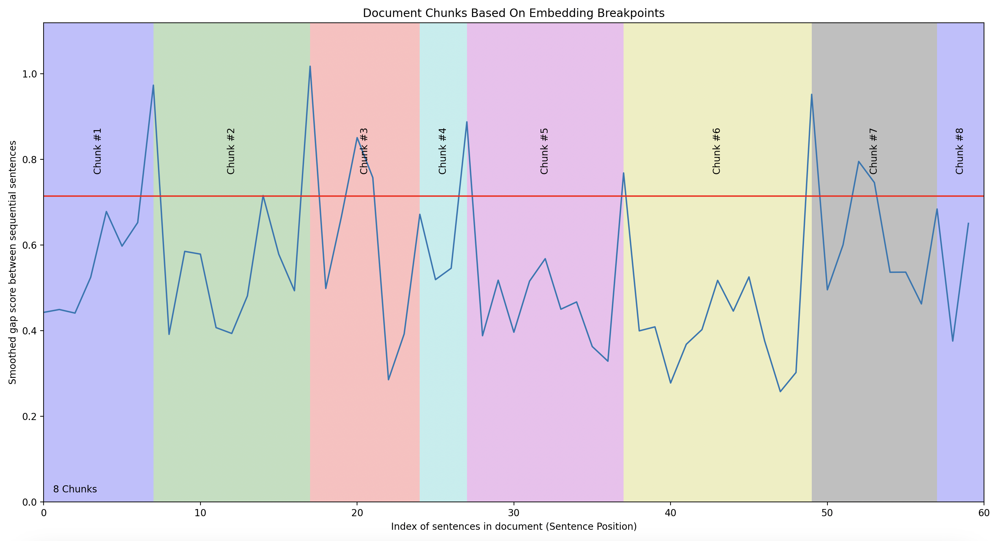

# Semantic Chunking Implementation

## Overview

This project is an implementation of a research paper on document segmentation, intended for my own learning. The paper is behind a paywall, so I based this implementation on a Medium article by the author.

Having spent the last year working on Retrieval-Augmented Generation (RAG) systems, I've realized that document splitting is a crucial component in information retrieval. Even as context windows in language models become longer, optimizing what information an LLM needs to see remains valuable.

Currently, the common methods for splitting documents involve using simple n-size chunks or splitting recursively based on regex characters. However, these methods are not always optimal for extracting the most relevant parts of a document. Ideally, sections of text should be grouped based on **topics**.

This research paper proposes a method called **semantic chunking**, which aims to split documents into groups of sentences that are most topically similar to each other.

## Main Methodology

- **Sentence Embeddings Generation**

  - The authors use SBERT to create dense vector representations for individual sentences, capturing their semantic content. These embeddings help measure the similarity between sentences, aiding in identifying coherence within topics.

- **Gap Scores Calculation**

  - Cosine similarity is calculated between sentence embeddings to determine the coherence between consecutive sentences. A parameter \( n \) is defined to specify the number of sentences compared, influencing the context length for analysis.

- **Smoothing**

  - A smoothing algorithm is applied to reduce noise in the raw gap scores, using a window size parameter \( k \). This balances the need to capture detailed transitions with computational efficiency.

- **Boundary Detection**

  - Local minima in the smoothed gap scores are identified to pinpoint potential topic transition points. A threshold parameter \( c \) is used to determine significant segmentation boundaries.

- **Clustering Segments**
  - The method clusters segments with similar content to address repeated topics within the document. This enhances the coherence and accuracy of the segmentation by reducing redundancy.

## Visualization

I've added a function to visualize the splits of documents, inspired by Greg Kamradt's notebook: [5 Levels of Text Splitting](https://github.com/FullStackRetrieval-com/RetrievalTutorials/blob/main/tutorials/LevelsOfTextSplitting/5_Levels_Of_Text_Splitting.ipynb).

## Disclaimer

All credits go to the original authors. I have yet to evaluate this method of chunking; this implementation is solely for my tinkering and learning.
